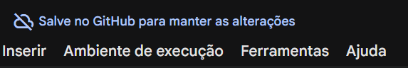

# Transformações de Intensidade e Segmentação

Esta atividade tem 2 objetivos principais:

- Entender o que são transformações radiométricas e como podem ser implementadas
- Explorar duas aplicações para as transformações radiométricas: normalização e segmentação.

## Realizando a Atividade

Você tem duas opções para realizar esta atividade:

### Google Colab

Para realizar a atividade no ambiente web do Google Colab, instale a extensão [Open in Colab](https://chromewebstore.google.com/detail/iogfkhleblhcpcekbiedikdehleodpjo?utm_source=item-share-cb). Abra o arquivo `.ipynb` e utilize a extensão para abrir o notebook.

Uma outra opção é formatar o link: https://colab.research.google.com/github/UNICAMP-EA979/NOME-DO-REPOSITÓRIO/blob/main/Atividade.ipynb
- Altere o `NOME-DO-REPOSITÓRIO` para ser o nome deste repositório

Após realizar a atividade, utilize a interface do Google Colab para realizar o commit:

### Localmente

Clone este repositório localmente e faça a atividade do arquivo "Atividade.ipynb".

Realize o commit ao terminar a atividade.